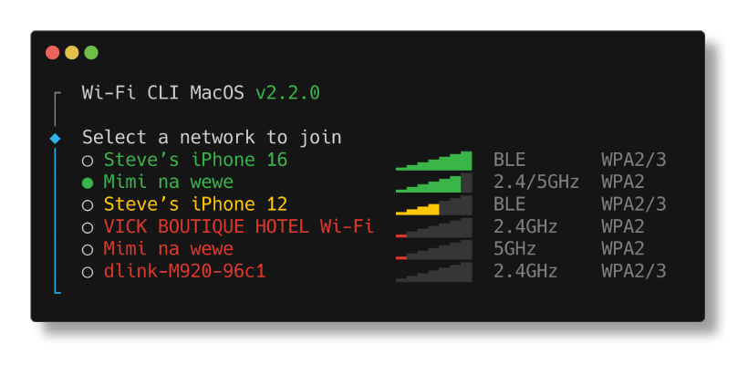

# 🛜 Wi-Fi CLI MacOS

Wi-Fi CLI MacOS is a command line utility for managing network connections on MacOS.



## Features

- 📡 Scan and connect to nearby Wi-Fi networks
- 📱 Detect nearby iPhone hotspots via BLE
- 🔒 Retrieve saved passwords from keychain automatically
- 🌐 Configure DNS, IP, MAC, and router addresses
- 🔁 Built-in DNS presets (Cloudflare, Google, OpenDNS, Quad9)
- 📷 Generate QR codes to share your Wi-Fi
- 🎭 Spoof your MAC address

## Commands

```sh
wifi connect (c) [network] [password]  # Connect to a Wi-Fi network
wifi disconnect (dc)                   # Disconnect from current Wi-Fi network
wifi dns [servers...]                  # Display or set DNS servers
wifi forget (f) [network]              # Forget a Wi-Fi network
wifi info (i)                          # Display current Wi-Fi connection details
wifi ip [address]                      # Display or set IP address
wifi list (ls)                         # List nearby Wi-Fi networks
wifi mac [address]                     # Display or set MAC address
wifi on                                # Turn Wi-Fi on
wifi off                               # Turn Wi-Fi off
wifi password (p)                      # Display current Wi-Fi network password
wifi qr                                # Display a QR code to join the network
wifi reset [target]                    # Reset DNS, IP, MAC, router to defaults
wifi restart (r)                       # Turn Wi-Fi off and on again
wifi router [address]                  # Display or set router address
wifi spoof                             # Randomize MAC address
```

## Installation

```sh
brew install stevelacey/tap/wifi-cli
```

Or via npm:

```sh
npm install -g wifi-cli-macos
```

> Xcode Command Line Tools are required. If not installed, you'll be prompted on first use.

## Basic usage

```sh
wifi list
Network 1  ▁▂▃▄▅▆  2.4/5GHz  WPA2
Network 2  ▁▂▃▄▅▆  5GHz      WPA2/3
Network 3  ▁▂▃▄    2.4GHz    WPA2
```

Running `wifi connect` with no arguments opens an interactive network selector:

```sh
◆  Select a network to join
│  ● Network 1 ▁▂▃▄▅▆  2.4/5GHz  WPA2
│  ○ Network 2 ▁▂▃▄▅▆  5GHz      WPA2/3
│  ○ Network 3 ▁▂▃▄    2.4GHz    WPA2
```

Or supply credentials directly:

```sh
wifi connect "Network 1" password
```

### Connection details

```sh
wifi info
Network:  Network 1
IP:       192.168.1.100 (dhcp)
Router:   192.168.1.1
DNS:      1.1.1.1 1.0.0.1 (default: 192.168.1.1)
MAC:      a1:b2:c3:d4:e5:f6 (default: b0:be:83:12:9c:d6)
```

### DNS

```sh
wifi dns
Current: 1.1.1.1 1.0.0.1
Default: 192.168.1.1
Presets:
  cloudflare:  1.1.1.1 1.0.0.1
  google:      8.8.8.8 8.8.4.4
  opendns:     208.67.222.222 208.67.220.220
  quad9:       9.9.9.9 149.112.112.112
```

```sh
wifi dns cloudflare
wifi dns 1.1.1.1 8.8.8.8
wifi reset dns
```

### IP, router, and MAC

```sh
wifi ip 192.168.1.99
wifi router 192.168.1.254
wifi mac a1:b2:c3:d4:e5:f6
wifi spoof
wifi reset ip
wifi reset mac
```

### QR code

```sh
wifi qr
Network:  Network 1
Password: hunter2
[QR code]
```
